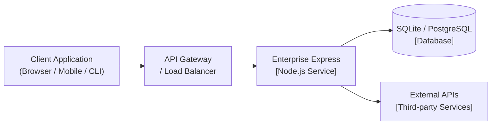
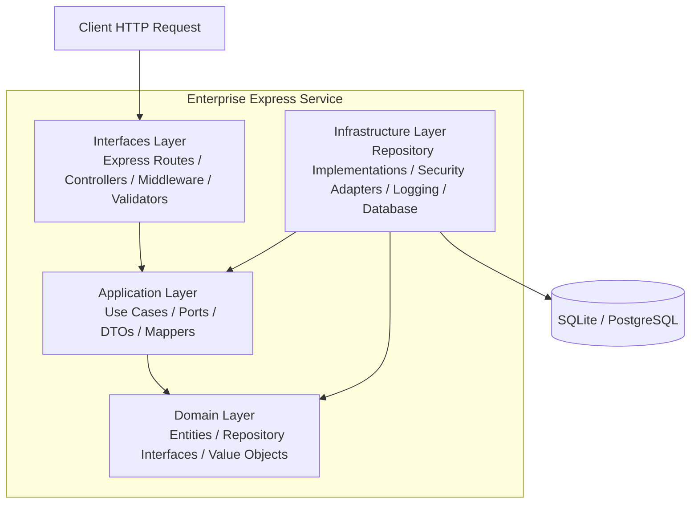
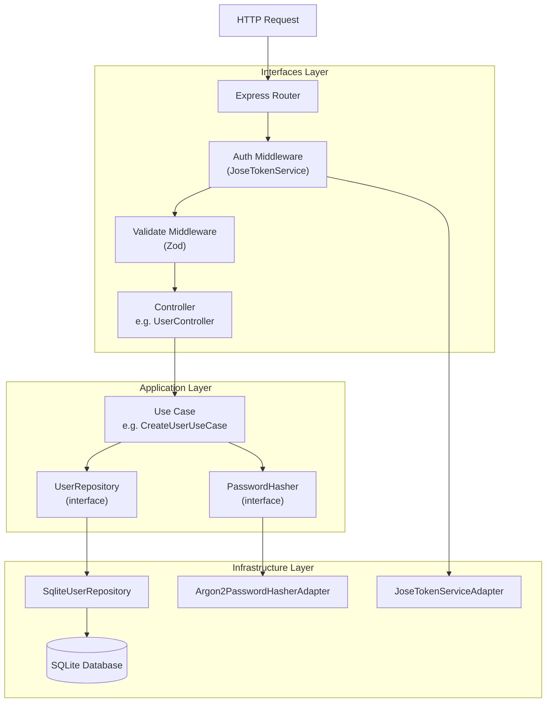

# C4 Architecture Model

The C4 model describes software architecture at four levels of zoom: **System Context**, **Container**, **Component**, and **Code**. This document covers the first three levels for Enterprise Express.

---

## Level 1: System Context

Shows where Enterprise Express sits within its broader environment and who interacts with it.

**What this answers:** What does this system do, and who interacts with it?

| Actor | Role |
|---|---|
| Client Application | Sends HTTP requests — browser, mobile app, CLI, or another service |
| API Gateway | Routes and load-balances inbound traffic to the service |
| Enterprise Express | Handles routing, validation, business logic, and persistence |
| Database | Stores domain entities (users, sample data) |
| External APIs | Reached through Infrastructure adapters — email, payments, etc. |

---

## Level 2: Container Architecture

Shows the major runtime components (layers) inside the Enterprise Express service.

**What this answers:** How is the system internally structured at runtime?

| Container | Responsibility | Example files |
|---|---|---|
| Interfaces | HTTP entry point — routing, middleware, validation, OpenAPI | `controllers/`, `routes/`, `middleware/`, `validators/` |
| Application | Business workflows — use cases, orchestration, ports | `use-cases/`, `ports/`, `dto/`, `mappers/` |
| Domain | Core rules — entities, repository contracts, error hierarchy | `entities/`, `repositories/`, `errors/` |
| Infrastructure | Technical details — database, security, logging, persistence adapters | `repositories/`, `security/`, `logging/`, `database/`, `persistence/` |

The dependency rule holds at this level: Interfaces and Infrastructure both depend on Application. Application depends on Domain. Domain depends on nothing.

---

## Level 3: Component Architecture

Zooms into the **Interfaces**, **Application**, and **Infrastructure** containers to show how a single authenticated request flows through the components.

**What this answers:** How does a request move through the components of the service?

Key observations:

- **Controllers** call use cases — never repositories or infrastructure directly
- **Use cases** depend on port interfaces — never concrete implementations
- **Infrastructure** implements interfaces — the dependency always points inward
- **Auth middleware** resolves the `TokenService` port through the same DI container

This is the dependency inversion principle in practice: the application layer defines what it needs (interfaces), and infrastructure provides the implementations.
