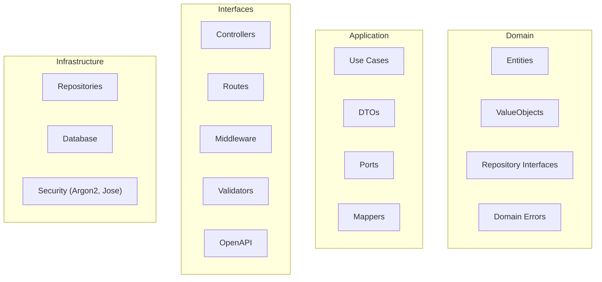
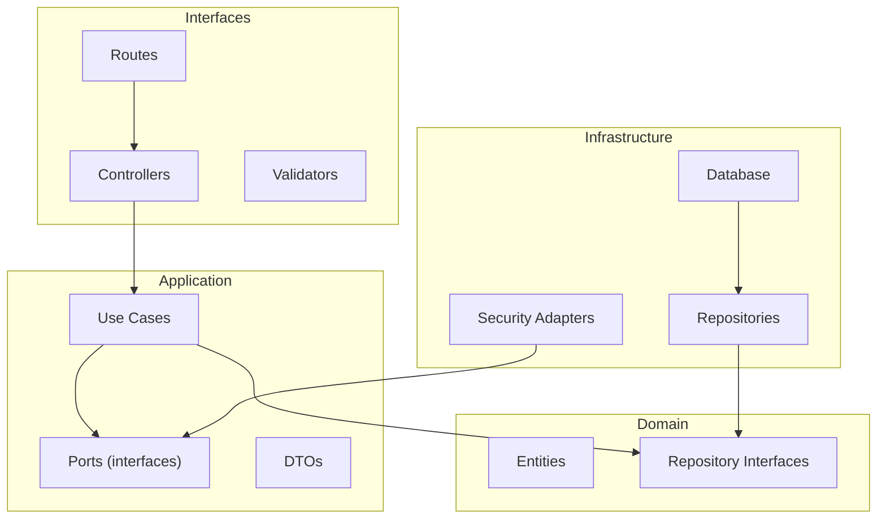
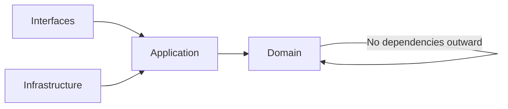
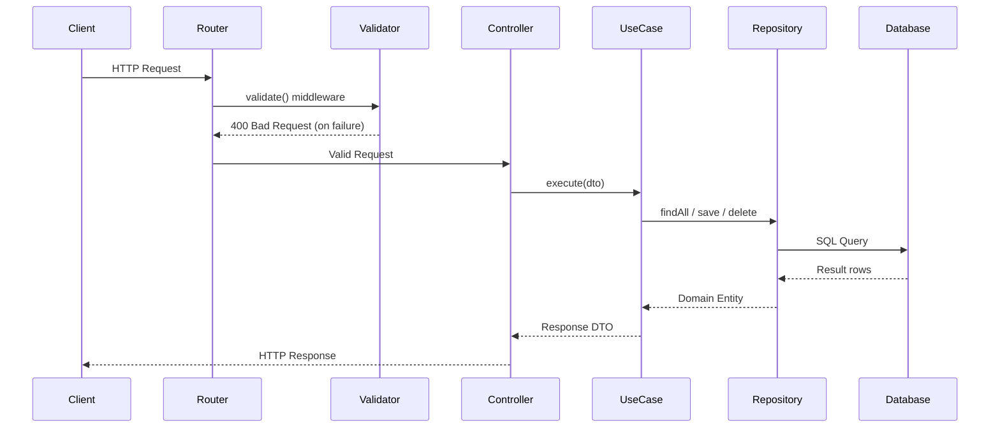
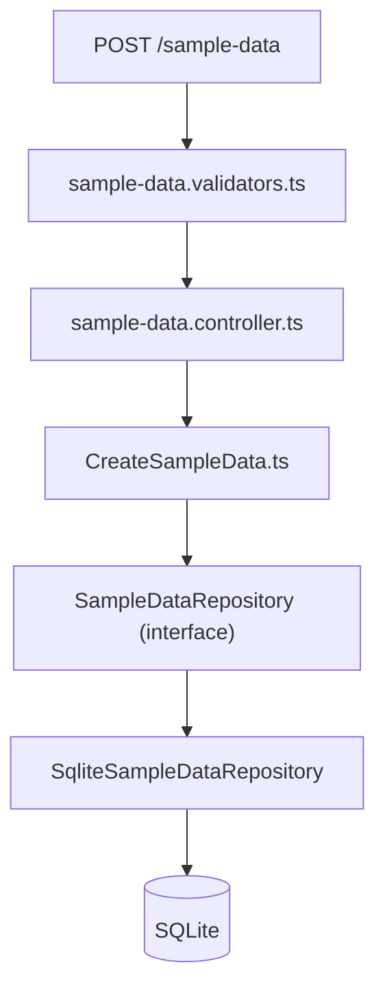

# Enterprise Express

Enterprise-grade TypeScript backend architecture for Node.js and Express
implementing Clean Architecture and production-ready service patterns.


---

## Table of Contents

- [Project Status](#project-status)
- [1. Introduction](#1-introduction)
- [2. Why Most Express Apps Become Unmaintainable](#2-why-most-express-apps-become-unmaintainable)
- [3. Architecture Overview](#3-architecture-overview)
- [4. Clean Architecture Diagram](#4-clean-architecture-diagram)
- [5. Dependency Rule](#5-dependency-rule)
- [6. Request Lifecycle](#6-request-lifecycle)
- [7. Example Feature Flow](#7-example-feature-flow)
- [8. Folder Structure](#8-folder-structure)
- [9. Layer-First vs Feature-First Organization](#9-layer-first-vs-feature-first-organization)
- [10. Architectural Goals](#10-architectural-goals)
- [11. Creating a New Feature](#11-creating-a-new-feature)
- [12. Composition Root](#12-composition-root)
- [13. Replaceable Infrastructure](#13-replaceable-infrastructure)
- [14. Transaction Boundaries and Unit of Work](#14-transaction-boundaries-and-unit-of-work)
- [15. Architecture Documentation](#15-architecture-documentation)
- [16. Testing Strategy](#16-testing-strategy)
- [17. Health Check](#17-health-check)
- [18. Running the Project](#18-running-the-project)

---

## Project Status

Enterprise Express is a **reference architecture and starter template** for building enterprise-grade Express services using TypeScript and Clean Architecture principles.

The goal is to demonstrate:

- Clean separation of concerns across domain, application, interfaces, and infrastructure layers
- Framework-independent business logic testable without HTTP or database context
- Production-ready backend patterns including auth, validation, logging, and OpenAPI
- A repeatable structure that scales into larger microservices

This project is intentionally minimal but structured to grow.

---

## 1. Introduction

### Who This Project Is For

Enterprise Express is designed for developers who want more structure than a typical Express application provides.

This project may be useful if you:

- Build **production backend APIs with Node.js**
- Prefer **clean architecture and separation of concerns**
- Come from **ASP.NET Core or Spring Boot backgrounds**
- Want **enterprise-style patterns in the Express ecosystem**
- Need a **maintainable foundation for microservices**

It is **not intended to replace frameworks**, but to provide a **clean architecture reference for Express services**.

### Why This Project Exists

Many Express applications begin simple but become difficult to maintain as they grow.

Enterprise Express introduces architectural principles commonly found in mature backend frameworks such as:

- ASP.NET Core
- Spring Boot

By applying these patterns to Express, this project demonstrates how Node.js services can remain **clean, testable, and maintainable at scale**.

### Comparison

Enterprise Express focuses on **architecture and maintainability** while staying close to the core Express ecosystem.

| Project | Focus | Architecture Style |
|--------|------|----------------|
| Express | Minimal web framework | Unopinionated |
| Fastify | High-performance web server | Plugin architecture |
| NestJS | Full framework | Angular-style modules |
| **Enterprise Express** | Reference architecture | Clean Architecture |

Enterprise Express intentionally remains **lightweight and framework-agnostic**, providing architectural structure without introducing additional runtime abstractions.

### Key Features

- **Clean Architecture** – domain, application, interfaces, infrastructure
- **Constructor-Based Dependency Injection**
- **Type Safety** with strict TypeScript configuration
- **Schema Validation** using Zod
- **JWT Authentication** using jose + Argon2
- **Structured Logging** with Pino
- **OpenAPI Documentation** via Zod schemas
- **Security Middleware** (Helmet, rate limiting)
- **Request Tracing** with request IDs
- **Unit & Integration Testing** using Vitest and Supertest

### Tech Stack

- **Language:** [TypeScript 5](https://www.typescriptlang.org/)
- **Runtime:** [Node.js v24.x](https://nodejs.org/)
- **Web Framework:** [Express 5](https://expressjs.com/)
- **Validation:** [Zod](https://zod.dev/)
- **Authentication:** [jose](https://github.com/panva/jose) + [Argon2](https://github.com/ranieri/node-argon2)
- **API Documentation:** Zod-to-OpenAPI + Scalar
- **Logging:** [Pino](https://github.com/pinojs/pino)
- **Testing:** [Vitest](https://vitest.dev/) + [Supertest](https://github.com/ladjs/supertest)

---

## 2. Why Most Express Apps Become Unmaintainable

In many Express.js applications, a single route handler or controller file often becomes a "God Object" responsible for:
- **Route logic** – parsing headers, query strings, and parameters.
- **Validation** – checking if the request body matches the expected shape.
- **Database queries** – calling an ORM or raw SQL directly.
- **Business logic** – calculating values, sending emails, or updating external systems.

As the application grows, this coupling makes it impossible to change the database without breaking the routes, or to test business logic without spinning up a full HTTP server.

**Enterprise Express** solves this by strictly separating these concerns into specialized layers, ensuring that your core business rules don't know—and don't care—whether they are being called by an Express route, a CLI command, or a background worker.

---

## 3. Architecture Overview

Enterprise Express follows **Clean Architecture** principles as described by Robert C. Martin.  
The goal is to keep business logic independent of frameworks, databases, and delivery mechanisms.

Core rules:

1. **Dependencies always point inward**
2. **Business logic does not depend on infrastructure**
3. **Frameworks are replaceable details**

This allows the application to remain flexible, testable, and maintainable.

### Design Decisions

#### Why TypeScript?
TypeScript provides compile-time safety and prevents an entire class of runtime errors. By using strict typing across boundaries, we ensure that changes in one layer break the build if they violate contracts in other layers—making refactoring safe and fearless.

#### Why Clean Architecture?
Classic Express.js apps often become tightly coupled "Big Balls of Mud" where routing, business logic, and database queries are completely intertwined. Clean Architecture forces a separation of concerns, ensuring our core business rules are testable in absolute isolation from HTTP state or database connections.

#### Why the Repository Pattern?
Abstracting our data access into repositories ensures that our business logic (services) does not care *how* data is stored or retrieved. If we ever need to swap our database provider, change our ORM, or mock database queries for fast unit testing, we only update the individual repository without modifying any core logic.

#### Why Validate at the HTTP Edge?
Zod validation schemas live in `src/interfaces/http/validators/` — the outermost layer. This ensures use cases only ever receive valid, sanitized data. The application layer's DTOs are plain TypeScript types with no Zod dependency, so the core business logic remains portable and testable without any HTTP context.

### Layer Responsibilities



---

## 4. Clean Architecture Diagram



This visually shows the **dependency direction toward the domain**.

### Domain
The **core business rules** and type contracts of the system. Has **zero dependencies** on any external framework, database, or library.

Contains:

- Domain entities (`User`, `SampleData`)
- Repository interfaces (contracts only — no implementation)
- Value objects (`Email`)
- Domain error classes (`NotFoundError`, `ValidationError`, etc.)

Example: `src/domain/entities/SampleData.ts`, `src/domain/repositories/SampleDataRepository.ts`

### Application (Use Cases)

Implements the **business workflows** of the system. Framework-agnostic — no Express, no Zod, no SQLite.

Contains:

- Use cases (one class per operation: `CreateSampleData`, `LoginUseCase`, etc.)
- Plain TypeScript DTOs (data shapes, no Zod)
- Port interfaces (`PasswordHasher`, `TokenService`)
- Mappers (domain entity → response DTO)

Example: `src/application/use-cases/sample-data/CreateSampleData.ts`

### Interfaces

Translates external HTTP requests into use case calls, and formats responses. All Express-specific code is confined here.

Contains:

- Controllers (thin orchestrators extending `BaseController`)
- Routes (function-based registration)
- Validators (Zod schemas — transport-specific)
- Middleware (auth, validate, rate-limit, logging, request-id)
- OpenAPI definitions

Example: `src/interfaces/http/controllers/sample-data.controller.ts`

### Infrastructure

Implements the interfaces defined by the domain and application layers. Handles all technical details.

Contains:

- Repository implementations (`SqliteSampleDataRepository`)
- Security adapters (`Argon2PasswordHasher`, `JoseTokenService`)
- Database connection

Example: `src/infrastructure/repositories/sample-data.repository.ts`

---

## 5. Dependency Rule

The **most important rule** in Clean Architecture: source code dependencies must point inward. Both `Interfaces` and `Infrastructure` depend on `Application`, and `Application` depends on `Domain` — never the reverse.



This reinforces the **Clean Architecture core rule**.

Dependencies **always point inward** toward the domain.

The domain layer must never depend on:

- Express
- Databases
- HTTP
- Framework code

---

## 6. Request Lifecycle

A typical request moves through the system like this:



This diagram helps reviewers understand **the runtime flow**.

---

## 7. Example Feature Flow



---

## 8. Folder Structure

The codebase is organized by architectural layer, with each layer containing only code that belongs to it.

```
src/
├── server.ts                         ← HTTP server startup & graceful shutdown
├── app.ts                            ← Express app, middleware stack, error handler
│
├── bootstrap/
│   ├── container.ts                  ← Composition root: wires all dependencies
│   └── routes.ts                     ← Mounts routes onto the Express app
│
├── domain/                           ← Core business rules (zero external dependencies)
│   ├── entities/                     ← User, SampleData
│   ├── repositories/                 ← Repository interfaces + SaveUserData type
│   ├── value-objects/                ← Custom domain value types (e.g. Email)
│   └── errors/                       ← DomainError base + NotFoundError, ValidationError,
│                                         UnauthorizedError, UserAlreadyExistsError, etc.
│
├── application/                      ← Use cases and orchestration (no framework dependencies)
│   ├── dto/                          ← Plain TypeScript types for inter-layer data
│   ├── mappers/                      ← Domain entity → response DTO conversions
│   ├── ports/                        ← PasswordHasherPort, TokenServicePort,
│                                         DatabaseHealthPort, UnitOfWorkPort, LoggerPort
│   └── use-cases/
│       ├── auth/
│       ├── users/
│       ├── sample-data/
│       └── system/
│
├── infrastructure/                   ← External systems (implements domain & application interfaces)
│   ├── database/                     ← SQLite connection and schema initialization
│   ├── logging/                      ← PinoLoggerAdapter (implements LoggerPort)
│   ├── persistence/                  ← SqliteUnitOfWorkAdapter, SqliteDatabaseHealthAdapter,
│   │                                     InMemoryUnitOfWorkAdapter, InMemoryDatabaseHealthAdapter
│   ├── repositories/                 ← SqliteUserRepository, SqliteSampleDataRepository,
│   │                                     InMemoryUserRepository, InMemorySampleDataRepository
│   └── security/                     ← Argon2PasswordHasherAdapter, JoseTokenServiceAdapter
│
└── interfaces/
    └── http/                         ← Express-specific code isolated here
        ├── controllers/              ← Thin: translate HTTP → use case → response
        ├── middleware/               ← auth, validate, rate-limit, log, request-id
        ├── routes/                   ← Function-based route registration + integration tests
        ├── validators/               ← Zod schemas for HTTP request validation
        └── openapi/                  ← OpenAPI path and schema definitions
```

This structure keeps business rules isolated, infrastructure replaceable, and the framework confined to one subdirectory.

## 9. Layer-First vs Feature-First Organization

Enterprise Express uses a **layer-first** structure — code is organized by architectural role (domain, application, interfaces, infrastructure). This is a deliberate choice for a reference architecture, because the layers themselves are the teaching subject.

### Layer-First (this project)

```
src/
├── domain/
├── application/
├── interfaces/
└── infrastructure/
```

Every file has an unambiguous architectural home. Reviewers learning Clean Architecture can navigate by layer and immediately understand what type of code belongs where.

The trade-off appears as the system grows:

```
src/application/use-cases/
├── auth/
├── users/
├── orders/
├── payments/
└── notifications/
```

Working on a feature requires jumping across `domain/`, `application/`, `interfaces/`, and `infrastructure/` — four directories for one change.

### Feature-First

An alternative used widely in large microservice codebases and DDD-inspired systems groups by business capability instead:

```
src/features/
├── user/
│   ├── domain/
│   │   ├── User.ts
│   │   └── UserRepositoryPort.ts
│   ├── application/
│   │   ├── CreateUser.ts
│   │   └── GetUser.ts
│   ├── interfaces/
│   │   ├── UserHttpController.ts
│   │   └── user.routes.ts
│   └── infrastructure/
│       ├── SqliteUserRepository.ts
│       └── InMemoryUserRepository.ts
├── auth/
│   └── ...
└── sample-data/
    └── ...
```

Everything for a feature lives in one directory. When an engineer opens `features/user/`, they see the domain model, use cases, controller, and repository without navigating elsewhere.

The dependency rules remain identical — `interfaces → application → domain`, `infrastructure → application` — the files are just co-located by feature rather than separated by layer.

### Hybrid (common in production)

Many teams combine both approaches: features grouped together, with shared cross-cutting concerns extracted separately.

```
src/
├── features/
│   ├── user/
│   ├── auth/
│   └── order/
│
├── shared/
│   ├── middleware/
│   ├── logging/
│   └── config/
│
└── bootstrap/
    └── container.ts
```

### Which to Choose

| Concern | Layer-First | Feature-First |
|---|---|---|
| Learning Clean Architecture | Clear — layers are explicit | Layers are implicit |
| Small to medium codebase | Works well | Overhead may not be worth it |
| Large codebase (10+ features) | Cross-folder navigation | Feature is self-contained |
| Team unfamiliar with DDD | Easier to onboard | Requires agreement on boundaries |
| Searching by business capability | Requires knowing which layer | Immediate |

Layer-first is the right default for a reference repository. Feature-first becomes the better choice when the feature count grows large enough that folder-hopping across layers becomes the dominant friction in daily development.

---

## 10. Architectural Goals

This design enables:

- **Separation of concerns**
- **Testability**
- **Framework independence**
- **Maintainability**
- **Scalability**

Because the domain is isolated, the application could switch from:

- Express → Fastify
- PostgreSQL → MongoDB
- REST → gRPC

without changing the core business logic.

---

## 11. Creating a New Feature

Enterprise Express organizes code by architectural layer. Every new feature follows the same repeatable pattern regardless of domain complexity.

### Implementation Flow

```
1. Define the domain entity
2. Define the repository interface (domain contract)
3. Create use cases (one class per operation)
4. Add validators, controller, and routes (interfaces layer)
5. Implement the repository (infrastructure layer)
6. Wire dependencies in bootstrap/container.ts
```

### Example: Adding an "Order" Feature

```
src/
├── domain/
│   ├── entities/
│   │   └── Order.ts                          ← Domain entity (pure class, no dependencies)
│   └── repositories/
│       └── OrderRepository.ts                ← Repository interface (contract only)
│
├── application/
│   ├── dto/
│   │   └── OrderDTOs.ts                      ← Input/output shapes (plain TypeScript types)
│   └── use-cases/
│       └── orders/
│           ├── CreateOrder.ts                ← One use case per operation
│           └── GetAllOrders.ts
│
├── interfaces/
│   └── http/
│       ├── validators/
│       │   └── order.validators.ts           ← Zod schemas for HTTP request validation
│       ├── controllers/
│       │   └── order.controller.ts           ← Thin: HTTP → use case → response
│       └── routes/
│           └── order.routes.ts               ← Route registration + integration tests
│
└── infrastructure/
    └── repositories/
        └── sqlite-order.repository.ts        ← Implements OrderRepository interface
```

### Wiring Dependencies

Once all pieces exist, register them in `bootstrap/container.ts`:

```typescript
// Infrastructure
const orderRepository = new SqliteOrderRepository();

// Use Cases
const createOrderUseCase = new CreateOrderUseCase(orderRepository);
const getAllOrdersUseCase = new GetAllOrdersUseCase(orderRepository);

// Controller
const orderController = new OrderController(createOrderUseCase, getAllOrdersUseCase);
container.register(OrderController, orderController);
```

The `SampleData` feature in this repo is a working reference implementation of this exact pattern.

---

## 12. Composition Root

All dependencies are assembled in one place: `src/bootstrap/`.

This is the **composition root** — the single location where every interface is matched to its concrete implementation before the application starts. It is the only place in the codebase where infrastructure implementations are imported directly.

### Why It Matters

The domain and application layers define _what_ they need through interfaces. But something must provide the concrete implementations at runtime. Without a dedicated composition root, wiring tends to scatter — controllers start importing repositories, use cases reach for infrastructure, and the architecture degrades.

Centralising it in `bootstrap/` means:

- Every dependency is explicit and visible in one file
- Swapping an implementation (SQLite → PostgreSQL) requires changing one file
- All other layers remain fully isolated from infrastructure choices

### Bootstrap Layer Structure

| File | Responsibility |
|---|---|
| `bootstrap/container.ts` | Instantiates infrastructure and wires use cases → controllers into the DI container |
| `bootstrap/routes.ts` | Resolves controllers from the container and mounts them onto the Express app |
| `app.ts` | Configures Express — middleware stack, body parsing, error handler |
| `server.ts` | Starts the HTTP listener and handles graceful shutdown (SIGTERM / SIGINT) |

### Dependency Assembly in `container.ts`

```typescript
// 1. Infrastructure — concrete implementations of domain/application interfaces
const userRepository = new SqliteUserRepository();
const passwordHasher = new Argon2PasswordHasherAdapter();
const tokenService = new JoseTokenServiceAdapter();
const databaseHealth = new SqliteDatabaseHealthAdapter();

// 2. Use Cases — injected through interfaces, never concrete types
const loginUseCase = new LoginUseCase(userRepository, passwordHasher, tokenService);
const createUserUseCase = new CreateUserUseCase(userRepository, passwordHasher);
const getHealthStatusUseCase = new GetHealthStatusUseCase(databaseHealth);

// 3. Controllers — injected with use cases
const userController = new UserController(createUserUseCase, getAllUsersUseCase, ...);

// 4. Register in the DI container for route resolution
container.register(UserController, userController);
```

This is the **only** file in the application that imports from `infrastructure/` directly.

---

## 13. Replaceable Infrastructure

One of the core claims of Clean Architecture is that infrastructure is a swappable detail. Enterprise Express demonstrates this concretely with two implementations of every repository interface.

### Repository Implementations

| Interface | SQLite (default) | In-Memory (tests/dev) |
|---|---|---|
| `UserRepository` | `SqliteUserRepository` | `InMemoryUserRepository` |
| `SampleDataRepository` | `SqliteSampleDataRepository` | `InMemorySampleDataRepository` |
| `UnitOfWorkPort` | `SqliteUnitOfWorkAdapter` | `InMemoryUnitOfWorkAdapter` |
| `DatabaseHealthPort` | `SqliteDatabaseHealthAdapter` | `InMemoryDatabaseHealthAdapter` |

The application layer — use cases, DTOs, mappers — is completely unaware of which implementation is active. Both are located in `src/infrastructure/repositories/`.

### Swapping Implementations

The composition root (`bootstrap/container.ts`) is the only place that changes:

```typescript
// Production — reads from SQLite
const userRepository = new SqliteUserRepository();

// Tests / development — no database required
const userRepository = new InMemoryUserRepository();
```

Everything downstream (use cases, controllers) continues to receive a `UserRepository` interface and never knows which backing store is in use.

### Why This Matters for Testing

The in-memory implementations make unit tests fast and self-contained:

```typescript
// No database, no network, no test containers — just plain TypeScript
const userRepository = new InMemoryUserRepository();
const useCase = new CreateUserUseCase(userRepository);
```

This is the dependency inversion principle producing a measurable outcome: the test suite requires no infrastructure at all.

---

## 14. Transaction Boundaries and Unit of Work

As services grow, use cases often need to coordinate writes across multiple repositories atomically. Without an explicit boundary, partial failures leave the system in an inconsistent state.

### The Problem

```typescript
// If the second call throws, the user is saved but the audit record is not
await userRepository.save(user);
await auditRepository.save(auditLog);
```

### The Port

The application layer defines the contract in `src/application/ports/UnitOfWorkPort.ts`:

```typescript
export interface UnitOfWorkPort {
    runInTransaction<T>(work: () => Promise<T>): Promise<T>;
}
```

Use cases depend on this interface — never on a database driver directly.

### Using It in a Use Case

```typescript
export class CreateUserUseCase {
    constructor(
        private userRepository: UserRepositoryPort,
        private auditRepository: AuditRepositoryPort,
        private unitOfWork: UnitOfWorkPort,
    ) {}

    async execute(input: CreateUserInput) {
        return this.unitOfWork.runInTransaction(async () => {
            const user = await this.userRepository.save(input);
            await this.auditRepository.record("user_created", user.id);
            return user;
        });
    }
}
```

The transaction scope is explicit, centralized, and visible in the use case signature.

### Infrastructure Implementations

| Interface | SQLite | In-Memory (tests/dev) |
|---|---|---|
| `UnitOfWorkPort` | `SqliteUnitOfWorkAdapter` | `InMemoryUnitOfWorkAdapter` |

`SqliteUnitOfWorkAdapter` wraps the work in `BEGIN` / `COMMIT` / `ROLLBACK`:

```typescript
// src/infrastructure/persistence/SqliteUnitOfWorkAdapter.ts
async runInTransaction<T>(work: () => Promise<T>): Promise<T> {
    db.exec("BEGIN");
    try {
        const result = await work();
        db.exec("COMMIT");
        return result;
    } catch (error) {
        db.exec("ROLLBACK");
        throw error;
    }
}
```

`InMemoryUnitOfWorkAdapter` is a no-op — it simply runs the work, which is correct for an in-memory store that has no transaction concept:

```typescript
// src/infrastructure/persistence/InMemoryUnitOfWorkAdapter.ts
async runInTransaction<T>(work: () => Promise<T>): Promise<T> {
    return work();
}
```

Tests that use the in-memory adapter require no database and still exercise the full use case logic.

### Why Many Node Projects Miss This

Most Node apps start small. Transactions are added later — by which point the code has direct ORM dependencies scattered through the business logic. Introducing `UnitOfWorkPort` early keeps transaction management a swappable infrastructure detail, consistent with every other port in the system.

---

## 15. Architecture Documentation

Detailed architecture diagrams are maintained in the `docs/` folder:

| Document | Contents |
|---|---|
| [C4 Architecture Model](docs/c4-model.md) | System Context, Container Architecture, Component Architecture |

### C4 Model Overview

The [C4 model](docs/c4-model.md) describes Enterprise Express at three levels of zoom:

- **Level 1 — System Context:** Where the service lives in the broader ecosystem (clients, gateway, database, external APIs)
- **Level 2 — Container Architecture:** How the four layers are structured at runtime and how they depend on each other
- **Level 3 — Component Architecture:** How a request flows through controllers, use cases, port interfaces, and infrastructure adapters

---

## 16. Testing Strategy

Enterprise Express uses **Vitest** for all test levels and **Supertest** for HTTP assertions. Tests are organized in a dedicated `tests/` directory that mirrors the architectural layers — the structure itself communicates that each layer is independently testable.

### Test Layout

```
tests/
├── unit/
│   └── application/          ← Use case logic, no HTTP or database
│       ├── Login.test.ts
│       ├── CreateUser.test.ts
│       └── GetHealthStatus.test.ts
│
├── integration/              ← Repository implementations against real infrastructure
│   └── (added as infrastructure grows)
│
└── e2e/                      ← Full HTTP stack via Supertest
    ├── auth.routes.test.ts
    ├── user.routes.test.ts
    └── sample-data.routes.test.ts
```

Running a specific level:

```bash
npm run test:unit    # fast — no HTTP server or database required
npm run test:e2e     # full stack via Supertest
npm test             # all tests (CI)
npm run test:watch   # interactive watch mode
```

### Unit Test — Application Layer

Use cases are tested in complete isolation. No Express, no database, no HTTP server — just plain TypeScript with mocked port interfaces:

```typescript
// tests/unit/application/GetHealthStatus.test.ts
import { GetHealthStatusUseCase } from "../../../src/application/use-cases/system/GetHealthStatus.js";
import type { DatabaseHealthPort } from "../../../src/application/ports/DatabaseHealthPort.js";

it("should report disconnected status when database is unavailable", async () => {
    const databaseHealth: DatabaseHealthPort = { check: vi.fn().mockResolvedValue("disconnected") };
    const useCase = new GetHealthStatusUseCase(databaseHealth);
    const result = await useCase.execute();

    expect(result.status).toBe("ok");
    expect(result.database).toBe("disconnected");
});
```

The test requires no infrastructure at all — no SQLite, no network. The `DatabaseHealthPort` interface is the only dependency, and it is fully mocked. This is the dependency inversion principle producing a measurable outcome.

### E2E Test — Full HTTP Stack

Route tests exercise the entire request lifecycle through routing, middleware, validation, use cases, and the real SQLite repository:

```typescript
// tests/e2e/sample-data.routes.test.ts
import request from "supertest";
import app from "../../src/app.js";

it("POST /sample-data should create a new item successfully", async () => {
    const response = await request(app)
        .post("/sample-data")
        .set("Authorization", authToken)
        .send({ title: "Test new task", completed: false });

    expect(response.status).toBe(201);
    expect(response.body.data.title).toBe("Test new task");
});
```

### What the Structure Communicates

A reviewer seeing `tests/unit/` and `tests/e2e/` as separate directories immediately understands that:

- business logic can be tested without spinning up a server
- the HTTP layer is independently verifiable
- infrastructure is a swappable detail, not a test dependency

This is the practical benefit of Clean Architecture made visible in the test layout.

## 17. Health Check

The service exposes a Production-Grade health check endpoint:

`GET /health`

Example response:

```json
{
  "status": "ok",
  "uptime": 123.45,
  "database": "connected",
  "timestamp": "2026-03-06T18:15:00Z"
}
```

This endpoint can be used by Kubernetes liveness/readiness probes, Docker health checks, load balancers, or uptime monitors to verify the service and its critical dependencies are functional.

---

## 18. Running the Project

### Rapid Setup

```bash
# 1. Install dependencies
npm install

# 2. Setup environment
cp .env.example .env

# 3. Ready to go
npm run dev
```

### Development Commands

| Command | Description |
| --- | --- |
| `npm run dev` | Starts the server with tsx watch mode and `.env` support. |
| `npm test` | Runs all tests (unit + e2e). For CI. |
| `npm run test:unit` | Runs unit tests only — no database or HTTP server required. |
| `npm run test:e2e` | Runs e2e tests only — full HTTP stack via Supertest. |
| `npm run test:watch` | Interactive watch mode for local development. |
| `npm run build` | Compiles TypeScript to JavaScript in `dist/`. |
| `npm start` | Production-style start using compiled JavaScript. |
| `npm run lint` | Runs Biome linter across `src/` and `tests/`. |
| `npm run format` | Auto-formats `src/` and `tests/` with Biome. |