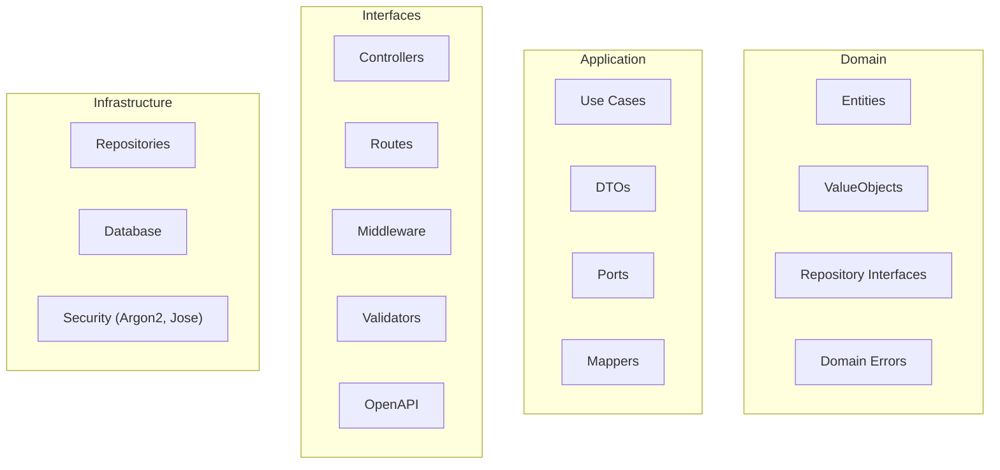
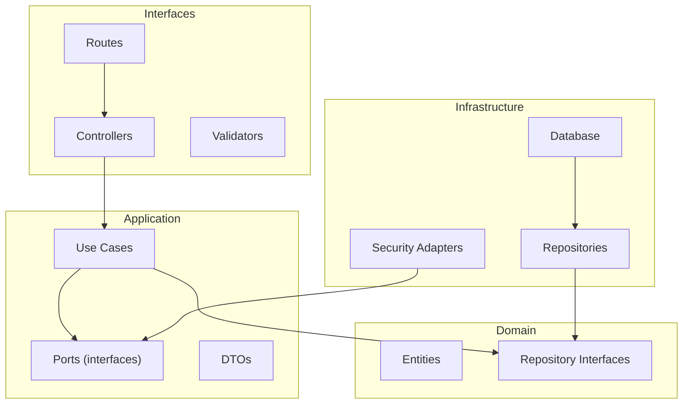
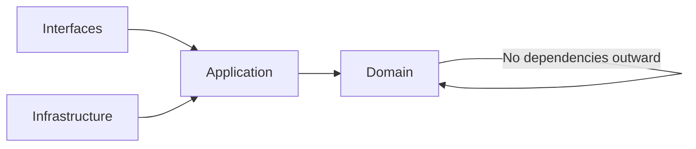
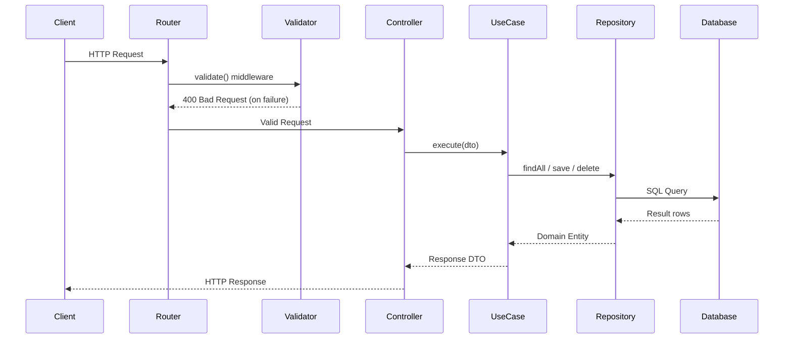
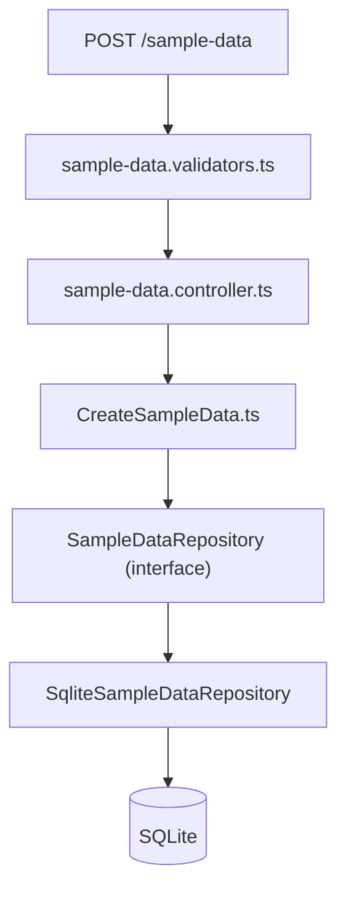

# Enterprise Express


Enterprise-grade TypeScript backend architecture for Node.js and Express implementing Clean Architecture, dependency injection, validation, OpenAPI, and production-grade patterns inspired by ASP.NET Core and Spring Boot.

---

## Project Status

Enterprise Express is a **reference architecture and starter template** for building enterprise-grade Express services using TypeScript and Clean Architecture principles.

The goal is to demonstrate:

- Clean separation of concerns across domain, application, interfaces, and infrastructure layers
- Framework-independent business logic testable without HTTP or database context
- Production-ready backend patterns including auth, validation, logging, and OpenAPI
- A repeatable structure that scales into larger microservices

This project is intentionally minimal but structured to grow.

---

## 1. Introduction

### Who This Project Is For

Enterprise Express is designed for developers who want more structure than a typical Express application provides.

This project may be useful if you:

- Build **production backend APIs with Node.js**
- Prefer **clean architecture and separation of concerns**
- Come from **ASP.NET Core or Spring Boot backgrounds**
- Want **enterprise-style patterns in the Express ecosystem**
- Need a **maintainable foundation for microservices**

It is **not intended to replace frameworks**, but to provide a **clean architecture reference for Express services**.

### Why This Project Exists

Many Express applications begin simple but become difficult to maintain as they grow.

Enterprise Express introduces architectural principles commonly found in mature backend frameworks such as:

- ASP.NET Core
- Spring Boot

By applying these patterns to Express, this project demonstrates how Node.js services can remain **clean, testable, and maintainable at scale**.

### Comparison

Enterprise Express focuses on **architecture and maintainability** while staying close to the core Express ecosystem.

| Project | Focus | Architecture Style |
|--------|------|----------------|
| Express | Minimal web framework | Unopinionated |
| Fastify | High-performance web server | Plugin architecture |
| NestJS | Full framework | Angular-style modules |
| **Enterprise Express** | Reference architecture | Clean Architecture |

Enterprise Express intentionally remains **lightweight and framework-agnostic**, providing architectural structure without introducing additional runtime abstractions.

### Key Features

- **Clean Architecture** – domain, application, interfaces, infrastructure
- **Constructor-Based Dependency Injection**
- **Type Safety** with strict TypeScript configuration
- **Schema Validation** using Zod
- **JWT Authentication** using jose + Argon2
- **Structured Logging** with Pino
- **OpenAPI Documentation** via Zod schemas
- **Security Middleware** (Helmet, rate limiting)
- **Request Tracing** with request IDs
- **Unit & Integration Testing** using Vitest and Supertest

### Tech Stack

- **Language:** [TypeScript 5](https://www.typescriptlang.org/)
- **Runtime:** [Node.js v24.x](https://nodejs.org/)
- **Web Framework:** [Express 5](https://expressjs.com/)
- **Validation:** [Zod](https://zod.dev/)
- **Authentication:** [jose](https://github.com/panva/jose) + [Argon2](https://github.com/ranieri/node-argon2)
- **API Documentation:** Zod-to-OpenAPI + Scalar
- **Logging:** [Pino](https://github.com/pinojs/pino)
- **Testing:** [Vitest](https://vitest.dev/) + [Supertest](https://github.com/ladjs/supertest)

---

## 2. Why Most Express Apps Become Unmaintainable

In many Express.js applications, a single route handler or controller file often becomes a "God Object" responsible for:
- **Route logic** – parsing headers, query strings, and parameters.
- **Validation** – checking if the request body matches the expected shape.
- **Database queries** – calling an ORM or raw SQL directly.
- **Business logic** – calculating values, sending emails, or updating external systems.

As the application grows, this coupling makes it impossible to change the database without breaking the routes, or to test business logic without spinning up a full HTTP server.

**Enterprise Express** solves this by strictly separating these concerns into specialized layers, ensuring that your core business rules don't know—and don't care—whether they are being called by an Express route, a CLI command, or a background worker.

---

## 3. Architecture Overview

Enterprise Express follows **Clean Architecture** principles as described by Robert C. Martin.  
The goal is to keep business logic independent of frameworks, databases, and delivery mechanisms.

Core rules:

1. **Dependencies always point inward**
2. **Business logic does not depend on infrastructure**
3. **Frameworks are replaceable details**

This allows the application to remain flexible, testable, and maintainable.

### Design Decisions

#### Why TypeScript?
TypeScript provides compile-time safety and prevents an entire class of runtime errors. By using strict typing across boundaries, we ensure that changes in one layer break the build if they violate contracts in other layers—making refactoring safe and fearless.

#### Why Clean Architecture?
Classic Express.js apps often become tightly coupled "Big Balls of Mud" where routing, business logic, and database queries are completely intertwined. Clean Architecture forces a separation of concerns, ensuring our core business rules are testable in absolute isolation from HTTP state or database connections.

#### Why the Repository Pattern?
Abstracting our data access into repositories ensures that our business logic (services) does not care *how* data is stored or retrieved. If we ever need to swap our database provider, change our ORM, or mock database queries for fast unit testing, we only update the individual repository without modifying any core logic.

#### Why Validate at the HTTP Edge?
Zod validation schemas live in `src/interfaces/http/validators/` — the outermost layer. This ensures use cases only ever receive valid, sanitized data. The application layer's DTOs are plain TypeScript types with no Zod dependency, so the core business logic remains portable and testable without any HTTP context.

### Layer Responsibilities



---

## 4. Clean Architecture Diagram



This visually shows the **dependency direction toward the domain**.

### Domain
The **core business rules** and type contracts of the system. Has **zero dependencies** on any external framework, database, or library.

Contains:

- Domain entities (`User`, `SampleData`)
- Repository interfaces (contracts only — no implementation)
- Value objects (`Email`)
- Domain error classes (`NotFoundError`, `ValidationError`, etc.)

Example: `src/domain/entities/SampleData.ts`, `src/domain/repositories/SampleDataRepository.ts`

### Application (Use Cases)

Implements the **business workflows** of the system. Framework-agnostic — no Express, no Zod, no SQLite.

Contains:

- Use cases (one class per operation: `CreateSampleData`, `LoginUseCase`, etc.)
- Plain TypeScript DTOs (data shapes, no Zod)
- Port interfaces (`PasswordHasher`, `TokenService`)
- Mappers (domain entity → response DTO)

Example: `src/application/use-cases/sample-data/CreateSampleData.ts`

### Interfaces

Translates external HTTP requests into use case calls, and formats responses. All Express-specific code is confined here.

Contains:

- Controllers (thin orchestrators extending `BaseController`)
- Routes (function-based registration)
- Validators (Zod schemas — transport-specific)
- Middleware (auth, validate, rate-limit, logging, request-id)
- OpenAPI definitions

Example: `src/interfaces/http/controllers/sample-data.controller.ts`

### Infrastructure

Implements the interfaces defined by the domain and application layers. Handles all technical details.

Contains:

- Repository implementations (`SqliteSampleDataRepository`)
- Security adapters (`Argon2PasswordHasher`, `JoseTokenService`)
- Database connection

Example: `src/infrastructure/repositories/sample-data.repository.ts`

---

## 5. Dependency Rule

The **most important rule** in Clean Architecture: source code dependencies must point inward. Both `Interfaces` and `Infrastructure` depend on `Application`, and `Application` depends on `Domain` — never the reverse.



This reinforces the **Clean Architecture core rule**.

Dependencies **always point inward** toward the domain.

The domain layer must never depend on:

- Express
- Databases
- HTTP
- Framework code

---

## 6. Request Lifecycle

A typical request moves through the system like this:



This diagram helps reviewers understand **the runtime flow**.

---

## 7. Example Feature Flow



---

## 8. Folder Structure

The codebase is organized by architectural layer, with each layer containing only code that belongs to it.

```
src/
├── server.ts                         ← HTTP server startup & graceful shutdown
├── app.ts                            ← Express app, middleware stack, error handler
│
├── bootstrap/
│   ├── container.ts                  ← Composition root: wires all dependencies
│   └── routes.ts                     ← Mounts routes onto the Express app
│
├── domain/                           ← Core business rules (zero external dependencies)
│   ├── entities/                     ← User, SampleData
│   ├── repositories/                 ← Repository interfaces (contracts, not implementations)
│   ├── value-objects/                ← Email, etc.
│   └── errors/                       ← NotFoundError, ValidationError, UnauthorizedError, etc.
│
├── application/                      ← Use cases and orchestration (no framework dependencies)
│   ├── dto/                          ← Plain TypeScript types for inter-layer data
│   ├── mappers/                      ← Domain entity → response DTO conversions
│   ├── ports/                        ← PasswordHasher, TokenService, Logger interfaces
│   └── use-cases/
│       ├── auth/
│       ├── users/
│       ├── sample-data/
│       └── system/
│
├── infrastructure/                   ← External systems (implements domain & application interfaces)
│   ├── database/                     ← SQLite connection
│   ├── logging/                      ← PinoLogger (implements Logger port)
│   ├── repositories/                 ← SqliteUserRepository, SqliteSampleDataRepository
│   └── security/                     ← Argon2PasswordHasher, JoseTokenService
│
└── interfaces/
    └── http/                         ← Express-specific code isolated here
        ├── controllers/              ← Thin: translate HTTP → use case → response
        ├── middleware/               ← auth, validate, rate-limit, log, request-id
        ├── routes/                   ← Function-based route registration + integration tests
        ├── validators/               ← Zod schemas for HTTP request validation
        └── openapi/                  ← OpenAPI path and schema definitions
```

This structure keeps business rules isolated, infrastructure replaceable, and the framework confined to one subdirectory.

## 9. Architectural Goals

This design enables:

- **Separation of concerns**
- **Testability**
- **Framework independence**
- **Maintainability**
- **Scalability**

Because the domain is isolated, the application could switch from:

- Express → Fastify
- PostgreSQL → MongoDB
- REST → gRPC

without changing the core business logic.

---

## 10. Creating a New Feature

Enterprise Express organizes code by architectural layer. Every new feature follows the same repeatable pattern regardless of domain complexity.

### Implementation Flow

```
1. Define the domain entity
2. Define the repository interface (domain contract)
3. Create use cases (one class per operation)
4. Add validators, controller, and routes (interfaces layer)
5. Implement the repository (infrastructure layer)
6. Wire dependencies in bootstrap/container.ts
```

### Example: Adding an "Order" Feature

```
src/
├── domain/
│   ├── entities/
│   │   └── Order.ts                          ← Domain entity (pure class, no dependencies)
│   └── repositories/
│       └── OrderRepository.ts                ← Repository interface (contract only)
│
├── application/
│   ├── dto/
│   │   └── OrderDTOs.ts                      ← Input/output shapes (plain TypeScript types)
│   └── use-cases/
│       └── orders/
│           ├── CreateOrder.ts                ← One use case per operation
│           └── GetAllOrders.ts
│
├── interfaces/
│   └── http/
│       ├── validators/
│       │   └── order.validators.ts           ← Zod schemas for HTTP request validation
│       ├── controllers/
│       │   └── order.controller.ts           ← Thin: HTTP → use case → response
│       └── routes/
│           └── order.routes.ts               ← Route registration + integration tests
│
└── infrastructure/
    └── repositories/
        └── sqlite-order.repository.ts        ← Implements OrderRepository interface
```

### Wiring Dependencies

Once all pieces exist, register them in `bootstrap/container.ts`:

```typescript
// Infrastructure
const orderRepository = new SqliteOrderRepository();

// Use Cases
const createOrderUseCase = new CreateOrderUseCase(orderRepository);
const getAllOrdersUseCase = new GetAllOrdersUseCase(orderRepository);

// Controller
const orderController = new OrderController(createOrderUseCase, getAllOrdersUseCase);
container.register(OrderController, orderController);
```

The `SampleData` feature in this repo is a working reference implementation of this exact pattern.

---

## 11. Architecture Documentation

Detailed architecture diagrams are maintained in the `docs/` folder:

| Document | Contents |
|---|---|
| [C4 Architecture Model](docs/c4-model.md) | System Context, Container Architecture, Component Architecture |

### C4 Model Overview

The [C4 model](docs/c4-model.md) describes Enterprise Express at three levels of zoom:

- **Level 1 — System Context:** Where the service lives in the broader ecosystem (clients, gateway, database, external APIs)
- **Level 2 — Container Architecture:** How the four layers are structured at runtime and how they depend on each other
- **Level 3 — Component Architecture:** How a request flows through controllers, use cases, port interfaces, and infrastructure adapters

---

## 12. Example Tests

The project uses **Vitest** for unit tests and **Supertest** for integration tests.

### Integration Test (API)

```typescript
describe("Sample Data Routes API (Integration)", () => {
    let authToken: string;

    beforeAll(async () => {
        const secret = new TextEncoder().encode(config.auth.jwtSecret);
        const token = await new SignJWT({ id: 1, role: "admin" })
            .setProtectedHeader({ alg: "HS256" })
            .setExpirationTime("1h")
            .sign(secret);
        authToken = `Bearer ${token}`;
    });

    it("GET /sample-data should return all items", async () => {
        const response = await request(app).get("/sample-data");

        expect(response.status).toBe(200);
        expect(response.body.success).toBe(true);
        expect(Array.isArray(response.body.data)).toBe(true);
    });

    it("POST /sample-data should create a new item", async () => {
        const response = await request(app)
            .post("/sample-data")
            .set("Authorization", authToken)
            .send({ title: "Test new task", completed: false });

        expect(response.status).toBe(201);
        expect(response.body.data.title).toBe("Test new task");
    });

    it("POST /sample-data should return 400 on invalid input", async () => {
        const response = await request(app)
            .post("/sample-data")
            .set("Authorization", authToken)
            .send({ completed: true }); // Missing required title

        expect(response.status).toBe(400);
        expect(response.body.message).toBe("Validation failed");
    });
});
```

This demonstrates full integration testing through the entire stack — routing, middleware, validation, service, and repository — without mocking.

---

## 13. Running the Project

### Rapid Setup

```bash
# 1. Install dependencies
npm install

# 2. Setup environment
cp .env.example .env

# 3. Ready to go
npm run dev
```

### Development Commands

| Command | Description |
| --- | --- |
| `npm run dev` | Starts the server with tsx watch mode and `.env` support. |
| `npm test` | Runs the integration and unit test suites utilizing Vitest and Supertest. |
| `npm run build` | Compiles TypeScript to JavaScript in `dist/`. |
| `npm start` | Production-style start using compiled JavaScript. |
| `npm run lint` | Runs Biome linter and formatter checks. |
| `npm run format` | Auto-formats source code with Biome. |